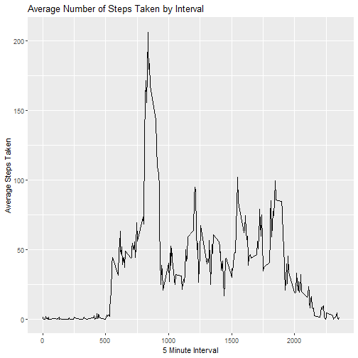

## Reproducible Research | Week 2 Peer-graded Assignment

This program reads activity data recorded in 5 minute intervals, and performs a variety of different analytics on that data.


The following code chunk reads and pre-processes the data.

```r
# read and filter data
source.data <- read.csv("activity.csv")
raw.data <- as.data.table(source.data)
clean.data <- raw.data[!is.na(steps),]
```

Having pre-processed data, we will answer the question, What is the mean total number of steps taken per day?


```r
sum.steps <- aggregate(steps ~ date,data = clean.data, sum)
ggplot(data = sum.steps,aes(x = steps)) + geom_histogram(binwidth = 250)
```


```r
mean.steps <- mean(sum.steps$steps)
median.steps <- median(sum.steps$steps)
cat(paste("Mean number of steps taken per day:",mean.steps))
```

```
## Mean number of steps taken per day: 10766.1886792453
```

```r
cat(paste("Median number of steps taken per day:",median.steps))
```

```
## Median number of steps taken per day: 10765
```
## We will now illustrate the average daily pattern of steps.


```r
average.steps <- as.data.table(aggregate(steps ~ interval, data = clean.data, mean))
ggplot(data = average.steps, aes(y = steps,x = interval)) + geom_line() +
  labs(title = "Average Number of Steps Taken by Interval") +
  labs(x = "5 Minute Interval") +
  labs(y = "Average Steps Taken")
```



```r
max.interval <- average.steps[steps == max(average.steps$steps),interval]
cat(paste("The interval with the highest average step-count across all days is:",max.interval))
```

```
## The interval with the highest average step-count across all days is: 835
```

## We will now anlayze the data including and maniupulating missing values. 

```r
na.count <- sum(is.na(raw.data$steps))
cat(paste("There are",na.count,"NA values in the dataset."))
```

```
## There are 2304 NA values in the dataset.
```

The NA values will now be replaced with the average steps taken for the interval of the given NA, produce a histogram of the data, and recalculate the mean and median steps taken.

```r
fill.data <- raw.data
fill.data[is.na(steps),steps := lapply(interval, function (x = interval,y = steps) {
  if(is.na(steps)){
    steps <- average.steps[interval == x,steps]}})]
sum.fill.data <- aggregate(steps ~ date,data = fill.data,sum)
ggplot(data = sum.fill.data,aes(x = steps)) + geom_histogram(binwidth = 250)
```


```r
na.mean <- mean(sum.fill.data$steps)
na.median <- median(sum.fill.data$steps)
cat(paste("Mean steps per day filling NA values:",na.mean))
```

```
## Mean steps per day filling NA values: 10749.7704918033
```

```r
cat(paste("Median steps per day filling NA values:",na.median))
```

```
## Median steps per day filling NA values: 10641
```

```r
cat(paste("As can be seen, filling NA values with the average for the interval results in a ",ifelse(na.mean < mean.steps,"fewer","greater"),"average number of steps taken in a day. Additionally, this results in a",ifelse(na.median < median.steps,"fewer","greater"),"median number of steps taken per day."))
```

```
## As can be seen, filling NA values with the average for the interval results in a  fewer average number of steps taken in a day. Additionally, this results in a fewer median number of steps taken per day.
```

## Finally we will assess the data bifurcating by weekday and weekend.

```r
fill.data[,date := ymd(date)]
fill.data[,day.type := ifelse(weekdays(date) == "Saturday" | weekdays(date) == "Sunday",
                              "Weekend",
                              "Weekday")]
fill.data[,day.type := as.factor(day.type)]
day.type.average <- aggregate(steps ~ day.type + interval,data = fill.data, mean)
ggplot(data = day.type.average, aes(x = interval,y = steps)) +
  geom_line() +
  facet_grid(.~ day.type)
```


